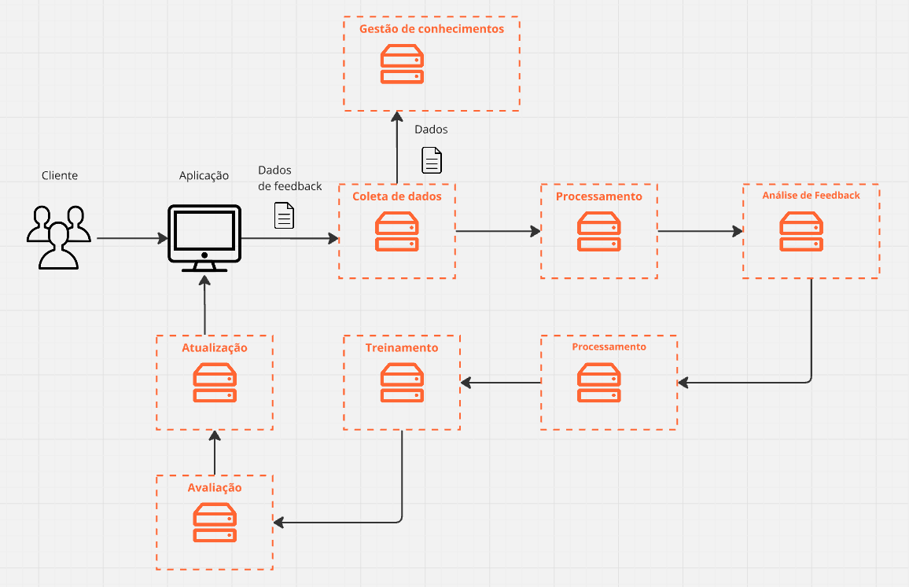

# ponderada_S6_M7

# Alternativa escolhida: 
(Alternativa 1) Considerando o paradigma de aprendizado contínuo, faça uma proposta de como fomentar este tipo de atualização no sistema conversacional

# Introdução:
Com o crescente uso de sistemas de inteligência artificial em diversos setores, os sistemas conversacionais, como chatbots e assistentes virtuais, tornaram-se ferramentas fundamentais para interações dinâmicas e eficientes entre humanos e máquinas. No entanto, esses sistemas enfrentam um grande desafio: manter-se atualizados em um ambiente de aprendizado contínuo, onde informações e necessidades dos usuários estão em constante evolução. O paradigma de aprendizado contínuo visa permitir que sistemas aprendam e se adaptem continuamente, incorporando novos conhecimentos sem a necessidade de reentreinamento completo ou interrupção do serviço.

A falta de um modelo de aprendizado contínuo eficaz pode resultar em respostas desatualizadas e em uma experiência de usuário insatisfatória. Segundo Lison (2016), sistemas conversacionais precisam ser flexíveis e ter a capacidade de aprender com interações anteriores para atender melhor às demandas dos usuários. Nesse sentido, a implementação de um modelo de aprendizado contínuo em um sistema conversacional pode garantir uma atualização dinâmica de conhecimento e a adaptação às novas intenções e necessidades de uso.

# Solução proposta

A solução proposta envolve a construção de uma arquitetura modular que permite a atualização contínua do sistema conversacional com base nas interações dos usuários. O diagrama de arquitetura abaixo descreve os principais módulos do sistema:

  Figura 1 - Diagrama de Arquitetura
  
  Fonte: Os autores (2024)

## Descrição dos Módulos:
- Módulo de Coleta de Dados (Input Pipeline):

Responsabilidade: Coleta todas as interações realizadas entre o usuário e o sistema conversacional. Esse módulo armazena as entradas em um banco de dados de interações para serem usadas posteriormente no processo de atualização e treinamento.
Função: Filtrar e armazenar dados relevantes que podem ser usados para melhorar o entendimento do sistema de novas intenções e atualizações.

- Módulo de Processamento de Interações:

Responsabilidade: Processa as interações coletadas para extrair novas intenções, entidades, ou padrões de linguagem que não foram previamente identificados.
Função: Utilizar técnicas de Processamento de Linguagem Natural (PLN), como análise de sentimento e extração de entidades, para identificar oportunidades de aprendizado a partir das interações dos usuários.

- Módulo de Feedback Explícito e Implícito:

Responsabilidade: Capturar feedback explícito (direto) dos usuários e feedback implícito (baseado nas ações e correções automáticas) para determinar a eficiência do sistema em fornecer respostas adequadas.
Função: Coletar e processar dados de correção para ajustar os modelos.

- Módulo de Treinamento Contínuo (Continuous Learning Engine):

Responsabilidade: Implementa o mecanismo de aprendizado contínuo, onde os novos dados coletados são usados para treinar o modelo sem comprometer o conhecimento já adquirido.
Função: Atualizar o modelo de maneira incremental, usando técnicas como online learning e experience replay, garantindo que o sistema evolua continuamente sem esquecer informações passadas.

- Módulo de Atualização Dinâmica:

Responsabilidade: Atualiza o sistema em tempo real com base nos novos padrões identificados pelo módulo de treinamento contínuo.
Função: Garantir que as atualizações ocorram sem a necessidade de reimplantação ou grandes períodos de inatividade.

- Módulo de Gestão de Conhecimento:

Responsabilidade: Mantém um repositório de conhecimento que armazena as intenções, entidades, e dados aprendidos pelo sistema. Isso inclui novas respostas e intenções adicionadas ao longo do tempo.
Função: Atualizar a base de conhecimento e disponibilizá-la para futuras interações do sistema.

- Módulo de Avaliação (Evaluation Engine):

Responsabilidade: Avaliar periodicamente a precisão e o desempenho do sistema atualizado, identificando áreas que necessitam de refinamento.
Função: Validar a eficácia do aprendizado contínuo e garantir que as atualizações mantêm a precisão desejada.

# Conclusão
A implementação de um sistema conversacional que emprega aprendizado contínuo traz diversos benefícios, incluindo a capacidade de adaptação às novas necessidades dos usuários sem interrupções e a incorporação de novos conhecimentos de maneira eficiente. No entanto, a execução desse projeto exige um esforço considerável de integração entre os diferentes módulos, bem como uma infraestrutura robusta que suporte o treinamento incremental de modelos e a atualização em tempo real do sistema. O sucesso dessa proposta depende, em grande parte, de um pipeline de dados bem projetado e de uma arquitetura modular que permita flexibilidade e escalabilidade conforme novas demandas surgem.

# Referências
LISON, Pierre. Towards Continuous Learning for Spoken Language Understanding in Dialogue Systems. In: INTERNATIONAL WORKSHOP ON SPOKEN DIALOGUE SYSTEMS TECHNOLOGY, 2016.

GOODFELLOW, Ian; BENGIO, Yoshua; COURVILLE, Aaron. Deep Learning. Cambridge: MIT Press, 2016.

BASS, Len; CLEMENTS, Paul; KAZMAN, Rick. Software Architecture in Practice. United States of America: Pearson Addison Wesley, 2021. 438p. ISBN 9780136886099.
